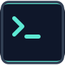

<p align="center">
  
</p>

<h1 align="center">Commando</h1>

<p align="center">
  <strong>The offensive workstation you command instead of memorize.</strong>
</p>

<p align="center">
  Pick a tool, click the options you want, and Commando builds the real command and runs it
  <br>in your own terminal. No more digging through man pages to remember a flag.
</p>

<p align="center">
  
  
  
  
  <br>
  
  
  
  
</p>

<p align="center">
  Made by <strong>Shakil Ahmed Srabon</strong>
</p>

---

## Contents

- [What is Commando](#what-is-commando)
- [Why I built it](#why-i-built-it)
- [How it works](#how-it-works)
- [Features](#features)
- [The tool catalog](#the-tool-catalog)
- [The Workstation](#the-workstation)
- [Installation](#installation)
- [Your first run](#your-first-run)
- [The wordlist picker](#the-wordlist-picker)
- [Is it heavy](#is-it-heavy)
- [Security and privacy](#security-and-privacy)
- [Troubleshooting](#troubleshooting)
- [FAQ](#faq)
- [Supported platforms](#supported-platforms)
- [Tech stack](#tech-stack)
- [Uninstall](#uninstall)
- [Add your own tool](#add-your-own-tool)
- [Responsible use](#responsible-use)
- [License](#license)
- [Credits](#credits)

---

## What is Commando

Commando is a clean web workstation for offensive security. You open it in your browser,
pick a tool from the sidebar, fill in your target, and click the options you want. Commando
writes the full command for you and sends it straight into a real terminal that lives right
there on the page.

The idea is simple. You should not have to memorize a hundred flags to get started. You
should be able to see what a tool can do, choose it, and run it. Commando keeps the power of
the real command line and takes away the part where you stare at a manual trying to remember
whether it was `-w` or `--wordlist`.

It is a website, but nothing runs in the cloud. A small helper program (the agent) runs on
your own machine and connects the page to your real shell. So when you press Run, the command
runs on your computer, in your terminal, exactly as if you typed it yourself.

> [!NOTE]
> Commando does not replace the tools. It drives the ones you already have installed. Think of
> it as a friendly control panel sitting on top of your normal terminal.

---

## Why I built it

When you are new to security, the hardest part is not understanding what a tool does. It is
remembering how to ask for it. Every tool has its own flags, its own order, its own quirks. You
end up with a folder of cheat-sheets and a browser full of tabs, and you spend more time
copying commands than actually learning.

I wanted the opposite of that. A place where the options are in front of you, where you can
read what each one does in plain language, and where building an advanced command is a matter
of clicking, not typing from memory. You still learn the command, because Commando shows you
exactly what it is about to run. You just do not have to hold all of it in your head on day one.

That is the whole point. You command. You do not memorize.

---

## How it works

Three pieces, and they are easy to picture.

```
   Your browser                Local agent                 Your machine
  (the Commando UI)        (small helper program)         (your real shell)

  click options   ---->    ws://127.0.0.1:8787    ---->    runs the command
  see the command  <----   streams the output     <----    prints the output
```

1. **The website** is the interface. It is static, hosted on GitHub Pages, and it holds the
   whole tool catalog. This is where you click things and watch the command take shape.

2. **The agent** is a small Go program that runs on your computer. It opens a real terminal
   session and bridges it to the browser over a local WebSocket on `127.0.0.1`. It is the only
   thing that touches your shell.

3. **Your terminal** is the real one. The command that runs is the exact command shown on the
   page. The output you see is the real output, streamed back live.

You install the agent once. After that, opening the site is all you do. The browser remembers
your token and reconnects on its own.

> [!IMPORTANT]
> Nothing leaves your machine except the commands you choose to run, and those only go to your
> own shell. The website talks to the agent on your own computer, not to any server of mine.

---

## Features

**Click to build commands.** Every tool is a panel of controls. Toggles, dropdowns, and text
fields map to real flags. You never have to remember syntax.

**A live command preview.** As you click, the command updates in front of you. You always see
exactly what will run before you run it, so you learn the syntax naturally.

**One-click presets.** Common setups (a quick scan, a full scan, a sensible default) are one
button. Great when you are starting out and not sure what to pick.

**A shared Context bar.** Set your target once at the top (RHOST, LHOST, LPORT, URL, and more)
and every tool picks it up. Change your target IP in one place and it flows everywhere.

**A real, multi-tab terminal.** The terminal on the page is a genuine shell, powered by
xterm.js. Open multiple tabs, run a listener in one and a scan in another.

**Sessions that survive a refresh.** If you reload the page or your network blips, the agent
keeps your shells alive and replays what was on screen. Long scans and reverse-shell listeners
do not die just because you refreshed.

**A wordlist picker.** For tools that need a wordlist, click Browse and pick from the wordlists
actually present on your machine. Add your own folder once and it is remembered. More on this
below.

**The Workstation.** Ready-to-use reverse shells, privilege-escalation checklists, and
situational cheat-sheets, all wired to your Context bar so they fill themselves in.

**Search.** One box across the top of the sidebar finds any tool, payload, or cheat-sheet.

**Clean and calm.** No clutter, no noise. Dark, readable, and quiet so you can focus.

---

## The tool catalog

Eleven tools to start, grouped the way you actually work. Each one is a self-contained
definition, so the list is meant to grow.

### Reconnaissance

| Tool | What it is for |
| --- | --- |
| **Nmap** | Network scanner for host discovery, port scanning, and service detection. |
| **Amass** | In-depth subdomain enumeration and attack-surface mapping. |

### Web

| Tool | What it is for |
| --- | --- |
| **Katana** | Fast web crawler for endpoint and URL discovery. |
| **ffuf** | Fast web fuzzer for directories, files, parameters, and vhosts. |
| **Gobuster** | Directory, file, and virtual-host brute forcing. |
| **Nuclei** | Template-based vulnerability scanner for known issues and misconfigurations. |
| **SecretFinder** | Discover API keys, tokens, and secrets inside JavaScript files. |

### Passwords

| Tool | What it is for |
| --- | --- |
| **Hydra** | Online brute-force login cracker for many network services. |
| **Hashcat** | GPU-accelerated offline password recovery. |
| **John the Ripper** | Versatile offline password cracker with autodetection. |

### Utility

| Tool | What it is for |
| --- | --- |
| **cURL** | Craft and inspect HTTP requests from the command line. |

> [!NOTE]
> Commando builds the commands. You still need the tools installed on your machine to run them.
> Each panel shows an install hint if a tool looks missing.

---

## The Workstation

Beyond the scanners, Commando ships a Workstation for the moments right after you land on a box.
Everything here reads from your Context bar, so set LHOST and LPORT once and these fill
themselves in.

- **Payloads.** Reverse shells in every common language, plus a matching listener you can start
  in one click in a fresh tab.

- **Privilege Escalation.** Quick-win checklists for Linux and Windows. Enumeration commands,
  SUID and capability checks, cron inspection, and a one-click linpeas download.

- **Cheat-sheets.** The things you reach for the second you get a shell. Upgrading a dumb shell
  to a full TTY, and moving files between your box and the target half a dozen ways.

---

## Installation

You do this once, ever. After that you just open the site.

**Requirements:** Go 1.21 or newer.

```bash
# 1. Clone the repository
git clone https://github.com/unrealsrabon/commando
cd commando/agent

# 2. Build the agent and install it as a background service
go build -o commando-agent . && ./commando-agent --install
```

What the install step does:

- Copies the agent to `~/.commando/commando-agent`
- Creates a permanent token at `~/.commando/token`
- Registers a background service (a LaunchAgent on macOS, a systemd user service on Linux)
- Starts it right away

From now on the agent starts automatically every time you log in. You never run it by hand again.

**Get your token:**

```bash
cat ~/.commando/token
```

**Open Commando, click Connect, and paste the token once.** The browser saves it, and every
future visit reconnects on its own.

> [!TIP]
> Rebuilt or updated the agent later? Run `./commando-agent --install` again. It replaces the
> installed copy and reloads the service so the new version is the one running.

---

## Your first run

A quick scan, start to finish.

1. Open Commando. It connects to your agent automatically.
2. In the Context bar at the top, set **RHOST** to your target, for example `10.10.10.5`.
3. Click **Nmap** in the sidebar. Notice the target is already filled from RHOST.
4. Click a preset like a service scan, or toggle the options you want. Watch the command build
   itself at the bottom of the panel.
5. Press **Run**. The command drops into the terminal and runs. The output streams back live.

That is the loop. Pick, click, run. The command is always visible, so after a few runs you will
start to recognize the flags without trying.

---

## The wordlist picker

Tools like ffuf, Gobuster, and Hydra need a wordlist, and remembering the exact path to the
right list is its own small headache. So the wordlist field has a **Browse** button.

Click it and Commando asks the agent to look through the usual wordlist folders on your machine
and shows you what is actually there. Pick one and its full path drops into the field. No typing
paths from memory.

Your lists live somewhere unusual? Add the folder once with **Add folder**. It is saved in your
browser and shows up every time after that, right alongside the built-in locations. You can
always still type or paste a path by hand, so nothing is ever locked behind the picker.

It stays light on purpose:

- It reads **file names only**, never the contents of any wordlist. A giant list like rockyou is
  never opened or loaded. All it collects is short paths.
- It runs **only when you click Browse**, does one pass, sends the list back, and stops. Nothing
  keeps running in the background afterward.
- It is **bounded**, so even a full SecLists returns quickly and never runs away with your machine.

> [!NOTE]
> Because it reads names only and stops as soon as it answers, Browse is effectively free. It is
> not a background indexer. It looks, it reports, it is done.

---

## Is it heavy

Short answer: no. Here is the honest breakdown.

| Question | The reality |
| --- | --- |
| Does the agent sit there using my CPU? | No. When idle it does nothing but wait for a connection. It is a small bridge, not a busy process. |
| Does the wordlist scan load huge files? | No. It reads file names only, never file contents, and only when you click Browse. |
| Does anything keep running after I close a popup? | No. The scan is one pass and then it stops. Nothing lingers. |
| Do my terminals eat memory when I am not looking? | Your shells stay alive across refreshes on purpose, so long scans survive. Close a tab to end its shell. |
| Is the website itself heavy? | It is a static page. It loads once and runs in your browser like any normal site. |

The agent stays running in the background because that is what lets the site connect instantly
and keeps your sessions alive through a refresh. That part is by design. It is not doing work
while it waits.

---

## Security and privacy

This runs on your own machine and touches your own shell, so it is fair to ask what it can and
cannot do. Here is the straight version.

- **Local only.** The agent listens on `127.0.0.1` and nothing else. It is not reachable from
  your network or the internet.
- **Token protected.** Every connection needs the token stored on your machine. No token, no
  connection.
- **No telemetry.** The website sends nothing to any server. There is no analytics, no tracking,
  no phone-home. The GitHub Pages site is just files.
- **Your data stays with you.** Your targets and settings are saved in your own browser storage,
  on your machine. They are never uploaded anywhere.
- **Clearing your browser is safe.** If you wipe browser data you just paste the token again. It
  cannot expose your machine.

And the honest part, because trust matters:

> [!WARNING]
> The agent can run commands in your shell. That is the entire point of the tool. It only runs
> what you choose to run, but it does have that power by design. Install it on machines you
> control, and only test systems you own or are clearly allowed to test.

---

## Troubleshooting

<details>
<summary><strong>Could not reach the agent</strong></summary>

<br>

The agent is not running. Check the service:

```bash
# macOS
launchctl list | grep commando

# Linux
systemctl --user status commando-agent
```

Start it if needed:

```bash
# macOS
launchctl load -w ~/Library/LaunchAgents/io.commando.agent.plist

# Linux
systemctl --user start commando-agent
```

</details>

<details>
<summary><strong>Authentication failed</strong></summary>

<br>

Your browser token does not match the agent token. Read the current one and paste it into the
Connect dialog:

```bash
cat ~/.commando/token
```

</details>

<details>
<summary><strong>Browse hangs or shows nothing</strong></summary>

<br>

This almost always means the agent running on your machine is an older build from before the
wordlist feature. The fix is to rebuild and reinstall it:

```bash
cd commando/agent
go build -o commando-agent . && ./commando-agent --install
```

Then refresh the site. The picker also gives up on its own after a few seconds and tells you to
restart the agent, so it will never spin forever.

</details>

<details>
<summary><strong>Reset the token</strong></summary>

<br>

```bash
rm ~/.commando/token
# Restart the agent and it generates a fresh one
```

</details>

<details>
<summary><strong>View the agent logs</strong></summary>

<br>

```bash
tail -f /tmp/commando-agent.log
```

</details>

---

## FAQ

<details>
<summary><strong>Is this a hacking tool for doing illegal things?</strong></summary>

<br>

No. It is a learning and productivity layer for authorized security testing. It drives standard,
well-known tools that are already on your machine. Use it on systems you own or have explicit
permission to test. See [Responsible use](#responsible-use).

</details>

<details>
<summary><strong>Do I need Kali Linux?</strong></summary>

<br>

No. Commando runs on macOS and Kali or other Linux. You do need the individual tools installed
for the commands to actually run, which is easy on Kali and doable anywhere.

</details>

<details>
<summary><strong>Does it work offline?</strong></summary>

<br>

The commands run entirely on your machine through the local agent, so the actual work is
offline. The page itself is loaded from GitHub Pages, so you need to load it once. After that
the connection to your agent is all local.

</details>

<details>
<summary><strong>Where does the wordlist picker look?</strong></summary>

<br>

It scans the common Kali and SecLists locations by default, plus any folder you add yourself.
Missing folders are skipped quietly, so the defaults are safe on any machine. It reads file
names only.

</details>

<details>
<summary><strong>Does it store my targets or send them anywhere?</strong></summary>

<br>

Your Context bar values are saved in your own browser storage so they survive a reload. They are
never uploaded. There is no server to upload them to.

</details>

<details>
<summary><strong>Can I add my own tools?</strong></summary>

<br>

Yes. Every tool is a plain data file. Add one definition and it shows up in the sidebar, the
search, and the command builder automatically. See [Add your own tool](#add-your-own-tool).

</details>

<details>
<summary><strong>Is my token safe?</strong></summary>

<br>

The token lives in a file on your machine and in your browser storage. The agent only accepts
connections from `127.0.0.1`, so even with the token, nothing off your machine can connect.

</details>

---

## Supported platforms

- **macOS** (installs as a LaunchAgent)
- **Kali Linux and other Linux** (installs as a systemd user service)

---

## Tech stack

| Part | Built with |
| --- | --- |
| Interface | React and TypeScript |
| Build and dev server | Vite |
| Terminal | xterm.js |
| Local agent | Go, with a real PTY bridge |
| Hosting | GitHub Pages, deployed by GitHub Actions |

---

## Uninstall

```bash
~/.commando/commando-agent --uninstall
rm -rf ~/.commando
```

That removes the background service and the local files. Done.

---

## Add your own tool

Commando is built so that content is data, not code. A tool is a single definition object that
describes its fields, flags, and presets. One engine turns any definition into a panel and turns
your clicks into a real command line.

To add a tool:

1. Create a file in `src/catalog/tools/` (copy an existing one as a starting point).
2. Describe the fields and how each maps to a flag.
3. Register it in `src/catalog/index.ts`.

It then appears in the sidebar, the search, and the command builder with no other changes. The
same pattern holds for Workstation payloads and cheat-sheets.

---

## Responsible use

Commando is for authorized work only. That means systems you own, lab machines, and targets you
have clear, explicit permission to test. It builds and runs real commands in your own terminal,
and you are responsible for what you run and where.

Do not point it at anything you are not allowed to. Being new is not an excuse the law accepts,
so learn on your own boxes and on legal practice platforms.

---

## License

Commando is released under the **Commando License**. In plain terms:

- You can use it for free, on your own machines and through the official site.
- You can read and study the source.
- You cannot sell it, and you cannot claim it as your own.
- You cannot host your own copy as a public or commercial service without written permission.

Full ownership stays with Shakil Ahmed Srabon. The complete terms are in the [LICENSE](LICENSE)
file. Want to do something the license does not cover? Ask.

---

## Credits

Designed and built by **Shakil Ahmed Srabon**.

Commando drives excellent open-source tools including Nmap, Amass, Katana, ffuf, Gobuster,
Nuclei, SecretFinder, Hydra, Hashcat, John the Ripper, and cURL. All credit for those tools goes
to their respective authors. Commando simply gives you a calmer way to command them.
